```{r setup, include = FALSE}
knitr::opts_chunk$set(echo = TRUE, cache = FALSE)
```

# Sharing with R Users

In this section we will cover 3 different aspects of sharing your R code with other 
technical R users. First by covering how to structure your code and version it on 
GitHub, but also the basics of building an R package since that is one way to 
concisely share your code with other R users.

## R Project Folder Structures

<p align="center">
  
</p> 

Many programming languages and frameworks use folder structures for configuration and 
extensibility. To not use a standard would mean reinventing the wheel each time and 
risk confusing/slowing down collaborators. This problem has been tackled by many 
individuals in the R community. Based on their suggestions I have adapted the following 
structure to be quick and easy to use: 

<p align="center">
  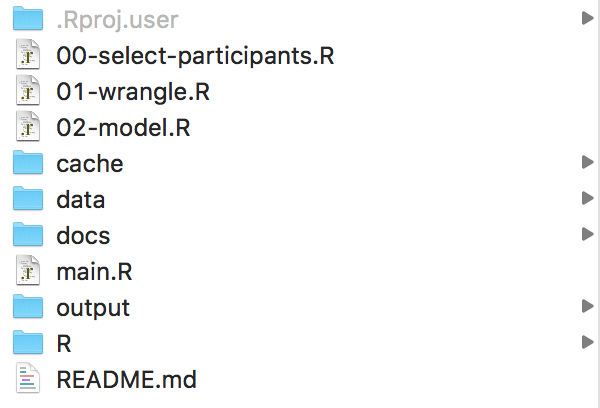
</p>  

The key features of this structure is that you physically separate the inputs, 
intermediate data, and outputs into three different folders: 

 1. `data`: Folder for put raw, unprocessed data
 2. `cache`: Folder for intermediate data, if needed
 3. `output`: Folder for cleaned data, plots, etc.
 
There are two remaining folders in the structure: 

<ol start="4">
  <li><code>docs</code>: Folder for supporting articles, explanations, and other documentation</li>
  <li><code>R</code>: Folder for R scripts that hold global settings or functions if needed</li>
</ol>

Oftentimes you have a few R scripts that are long and complicated. I recommend breaking 
up sequential steps into smaller files that numbered so that the order to run 
them is obvious and then call each of them using the `source()` function. This way 
you can create a file called `main.R` that you can configure to run all of your 
analysis from one file. 

An example of a `main.R` file might look like this: 

```{r main-example, eval=FALSE}
# set runtime options and load packages ------------------------------

options(stringsAsFactors = FALSE, scipen = 99)

suppressMessages(library(here)) # to manage file paths
suppressMessages(library(tidyverse)) # to process data

# load R scripts that contains variables and functions for the analysis
source(here::here("R", "globals.R"))
source(here::here("R", "helpers.R"))

# create a folder for storing the output of the analysis from today
# this way your output doesn't accidentally get overwritten from another time
todays_date_formatted <- format(Sys.Date(), '%Y%m%d')
dir.create(here::here('output', todays_date_formatted), showWarnings = FALSE)

# sourcing scripts to run analysis -----------------------------------

source(here::here('01-wrangle.R'))
source(here::here('02-model.R'))
```

### Caching

Sometimes your project will involve a very large dataset or a sequence of complex and 
long-running processing steps. "Caching" is a term for saving off your analysis 
mid-way through the process so that you can restart it exactly from that particular 
spot. R Markdown documents have this built into them, but you can also do this from 
any R script by using the package **simpleCache**. **simpleCache** was created at 
the University of Virginia in part by the UVA R Users Group organizer, VP (Pete) Nagraj.
Below is an example that uses a simulation to confirm the theoretical standard error. 
The value is stored in the variable `std_err`. The caching process will check the 
`cache` folder and if the object exists, then that block of code is not run and 
the cached output is loaded from the cache folder. If the cached object is not found, 
then the code runs, creates the object, and saves it to the cache folder.
 
```{r cache-example, eval=FALSE}
install.packages('simpleCache')
suppressMessages(library(here))  # for file management
suppressMessages(library(simpleCache)) # for caching long running parts of the script 

# set the cache directory
setCacheDir(here::here('cache'))
# delete the files if you want to refresh the cache or run `deleteCaches()` 

# the mean of 1000 standard normal observations has a standard deviation 
# that should approach 1/sqrt(1000) = 0.0316
simpleCache("std_err", {
  n_sample_avgs <- numeric(100)
  for(i in 1:100){
    n_sample_avgs[i] <- mean(rnorm(1000, 0, 1))
  }
  sd(n_sample_avgs)
})
```

### Resources

Here is a list of resources to help you review and inform your approach: 

 - [**RProjectTemplate**](http://projecttemplate.net/architecture.html) by John Myles White
 - [**pRojects**](https://itsalocke.com/projects/) by Steph Locke
 - [**new-project-template**](https://github.com/pavopax/new-project-template) by Paul Paczuski
 - [**Cookiecutter Data Science**](https://drivendata.github.io/cookiecutter-data-science/#directory-structure) (it is for Python, but applies to R)
 
## GitHub + Git flow


Once you have worked hard on creating a project in R you typically want to do 2 
things: 1) Backup the work you've done and 2) Share it with others. GitHub is the 
de facto place to accomplish both of these tasks at once. GitHub is an online 
(cloud) service owned by Microsoft that allows developers to not only host their 
code, but collaborate with others on it there. They have designed a nice website 
to see what is happening with your code. The process of putting your code onto 
GitHub involves using **git**, which is a version control tool. Git tracks changes 
in plain-text files. It goes line-by-line pointing out any changes, keeping track 
of each version, and allowing you to review. GitHub just displays those changes 
on their website along with the files so it's easier for you to follow along.

Git init

### Merge Conflicts

Merge conflicts happen when you have edited a part of the code locally that someone 
else has already changed and committed. When you "pull" their changes down to your 
computer git will immediately warn you and section off the part of the code that is 
problematic. 

<p align="center">
  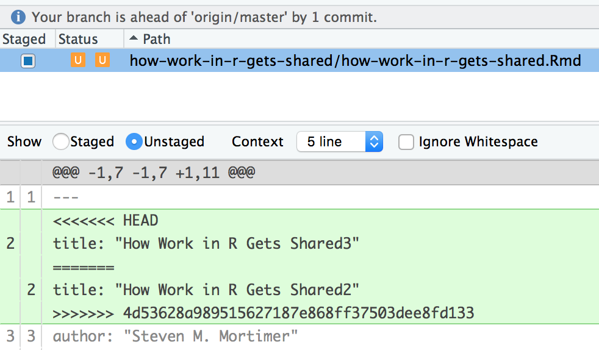
</p> 

### Git Branches

 - Pull from Git Scenarios Talk (walk through examples?)

## R Package Structure
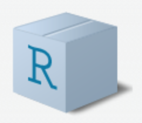

>"If you have more than two functions in your project then you should consider 
making an R package.  – Anonymous"

Hadley Wickham brings up the point that packages conform to a standard, so you 
do not have to think about structuring your work and they save you time because 
of all the tools made to support you while making a package.

CRAN (Comprehensive R Archive Network) is a central location where fully-vetted R 
packages are shared with the world, but you can just as easily create and share packages 
in a shared folder, on GitHub, or elsewhere. For example, many R packages are hosted 
on GitHub, so if you want to install them, you do not need to get them from CRAN. You 
can go straight to the source on GitHub and download it like so: 

```{r package-github-download, eval=FALSE}
library(devtools)
# this installs the dplyr package from GitHub, instead of CRAN
# the format is {{GitHub Username}}/{{Package Name}}
install_github('tidyverse/dplyr') 
```

### Package Architecture

The most exciting structure and tool that Hadley was talking about in R packages 
is the ability to generate documentation and examples for your R functions. First, 
you create a folder called `R` that keeps `.R` scripts. If you add documentation 
above each function, then a package called **roxygen** will generate the `?help` 
pages (in the package's `man` folder). This is how all packages have a PDF index 
of functions and the "Help" pane in RStudio. Here is a side-by-side example of a 
function (`sayhello()`) and how documentation is created by following a standard 
format.

<p align="center">
  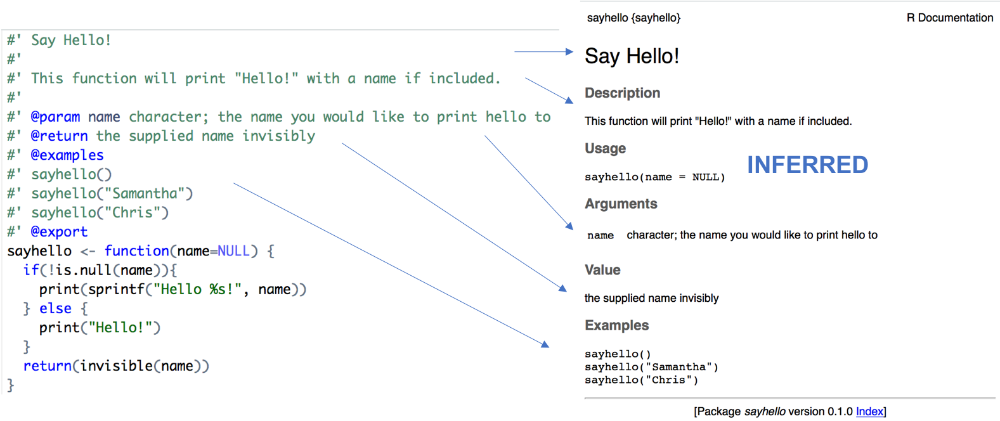
</p>

Running the function `devtools::document()` automatically creates all of the help 
pages in the folder `man` along with a list of the package functions in the `NAMESPACE` 
file. The only other files that are needed for the package are the `DESCRIPTION` and `LICENSE`.

<p align="center">
  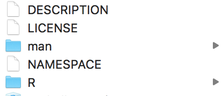
</p>

Writing an R package does not need to be intimidating. The steps are literally: 

 1. Create a folder with another folder inside called "R"
 2. Throw all your R scripts in there and make sure they have documentation above the functions
 3. Run `devtools::document()` to generate `man` folder and `NAMESPACE` file
 4. Add the `DESCRIPTION` and `LICENSE` files
 
The hardest part is Step 2, writing all your functions and documenting them and 
that is the way it should be. The most focus should be on your unique knowledge and 
documenting it for others to use. The rest can be done in minutes.

### Package Testing/Integrity 

A common facet of R packages is their tests. When you create a package you can 
also create tests for its functions to check that they all behave as you would 
expect before sharing it with others. Creating these tests is a really good idea 
because it forces you to define how your functions should work in good cases and 
in bad cases. In the example `sayhello()` function show above the `name` parameter 
should be a character, but what might happen if it encounters a number or an `NA` 
missing value? That is the purpose of tests, to document and define the behavior of 
your functions under a variety of scenarios. So for this package we add one more 
folder called `tests` and include two R scripts. One script is a runner for the 
entire package and the other script is to test our function. In the example below 
we are testing what the function does and what we expect for numbers, logicals, missing, 
and NULL values.

<p align="center">
  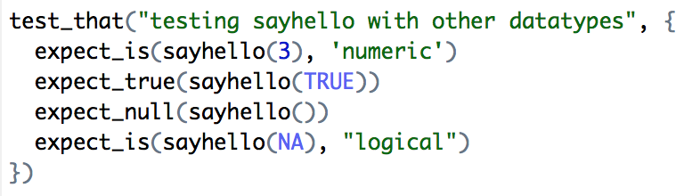
</p>

Since testing is a hallmark of good software design there are people who provide 
free computers to deploy your software to whenever you make changes. The folks at 
[TravisCI](http://travis-ci.org) and [CodeCov](http://codecov.io/) do exactly that. 
If you put special configuration files inside your R package, then everytime the 
code goes to GitHub, a server will be spun up with your new code and your tests 
will be run. This is why you might see extra files inside R packages called `.travis.yml` 
or `codecov.yml` along with many other types of configuration files. Here is an example 
where the maintainers of the **dplyr** package test the package on 7 different computer 
environments to ensure stability when the code is modified.

<p align="center">
  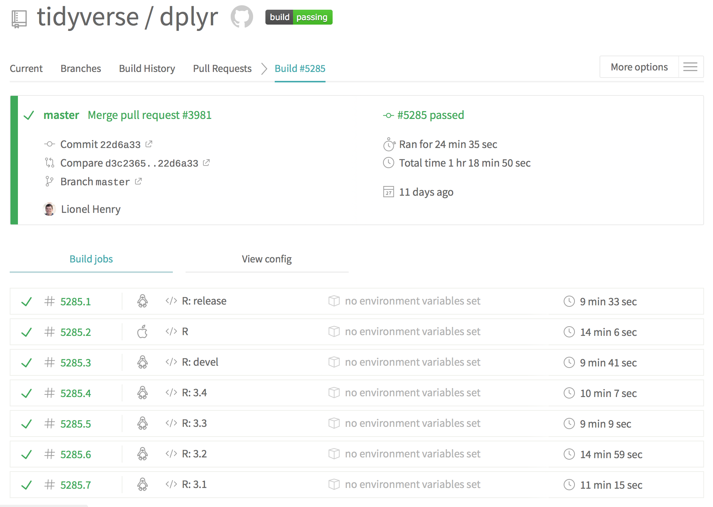
</p>

### Resources

Here are a few resources to help you create an R package:

 - [**R Packages**](http://r-pkgs.had.co.nz) by Hadley Wickham
 - [*Writing an R Package from scratch*](https://hilaryparker.com/2014/04/29/writing-an-r-package-from-scratch/) by Hilary Parker
 - [**sayhello**](https://github.com/StevenMMortimer/sayhello) - a basic example package with only one function
 
# Sharing with non-R Users

In this section we will cover three tools to share your analysis with individuals who 
do not know about R and are only concerned with the insights or analysis you've 
derived by using R. 

## Google Sheets


Most everyone in the business world is familiar with spreadsheets. The problem with 
Excel spreadsheets is that they are are typically created and emailed to others. 
This is not a huge problem, but if you want to create reproducible analyses and 
push the results to others quickly, then Google Sheets is a handy alternative. There 
is the **googlesheets** package that lets you authenticate as yourself from within 
R to access all your documents on Google Drive and edit them just like you would 
from your browser. I have created a Google Sheet that is located at: https://docs.google.com/spreadsheets/d/1f2h0UU-GYEX9HDc2HKp918D3Vrf21Xirj5iHRfmuOfM/edit?usp=sharing.

```{r gs-example, eval=FALSE}
library(googlesheets)
ss <- gs_url("https://docs.google.com/spreadsheets/d/1f2h0UU-GYEX9HDc2HKp918D3Vrf21Xirj5iHRfmuOfM")
gs_edit_cells(ss, ws=1, input = "Hello", anchor="B2")
gs_edit_cells(ss, ws="iris", input = iris, anchor="A1")
```

A nice benefit to using Google Sheets, besides on-demand editing from R, is that 
Google Sheets has in-built versioning. If you click `File` -> `Version history` -> 
`See version history`, then you can see how the data has changed, by whom, and you can 
revert it back if necessary.

<p align="center">
  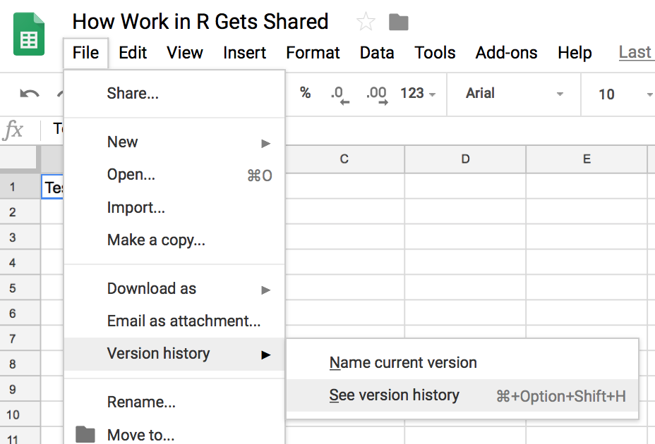
</p>

## R Markdown


R Markdown is a style of writing R code and text that makes it easier to write long-form 
blogs, papers, and articles because the numerical elements of the analysis can be seamlessly 
incorporated into the text without having to copy and paste. 

For example, you can embed the average of numbers one thru ten as 
<code class="r">&#96;r mean(1:10)&#96;</code>, which evaluates to `r mean(1:10)`. 
This is an example where R code is executed "in-line" with the text. Typically, 
you produced tables and figures separately then incorporate text, so R Markdown 
uses the concept of "chunks". Chunks are snippets of R code that are executed 
sequentially. Including this code in your R Markdown document:

<div class="sourceCode"><pre class="sourceCode r">
<code class="sourceCode r">&#96;&#96;&#96;{r, echo=TRUE, eval=TRUE, cache=TRUE}<br>
x <- 2 + 2
y <- 3 + 3
x + y
&#96;&#96;&#96;</code></pre></div>

will yield the following:

```{r}
x <- 2 + 2
y <- 3 + 3
x + y
```

R Markdown is so powerful because you can explain the code right after showing it. 
The included text breaks up the code into "chunks".

### R Markdown YAML Header

The format of the document that R Markdown will generate is determined by its "YAML". 
The YAML is a section at the top of the document and is parsed by the R Markdown engine **knitr**. 
Here is the YAML for this document: 

```{r, eval=FALSE}
---
title: "How Work in R Gets Shared"
author: "Steven M. Mortimer"
date: "12/12/2018"
output: 
  github_document:
    toc: true
    toc_depth: 2
---
```

This tells **knitr** that it should produce a GitHub document (a speciic type of markdown) 
with a table of contents that includes all the first and second-level headers. 

### Non-R Code

The interesting thing is that R Markdown can incorporate other languges such as Python: 

```{python}
squares = [x**2 for x in range(10)]
print squares
```
 
### Resources

If you would like to learn more about R Markdown, then I highly recommend reading 
[R Markdown: The Definitive Guide](https://bookdown.org/yihui/rmarkdown/).

## R Shiny


The shift towards web-based technologies as a means to deliver information has put 
increasing pressure on business analysts to communicate results via the web. Shiny 
is a web application framework for R that harnesses the power of modern web technologies. 
You can build sophisticated web applications using simple pieces of R code that 
you already know well.

First, you must create a folder for your app and put all related files inside that 
folder. At minimum every Shiny app contains 2 parts: 

 1. A UI (client-side) that is specified in a file called `ui.R`
 2. Server Logic (server-side) that is Specified in a file called `server.R`
 
**Example UI Code**
```{r example-ui-code, eval=FALSE}
library(shiny)
shinyUI(
  fluidPage(
    titlePanel('Revenue Prediction from Marketing Expenditures'),
    sidebarLayout(
      sidebarPanel(
        sliderInput(inputId = 'spend', 
                    label = 'Expenditure Level in $K:',
                    min = 54, max = 481, value = 250)
      ),
      mainPanel(
        plotOutput('prediction_plot')
      )
    )
  )
)
```
 
**Example Server Code**
```{r example-server-code, eval=FALSE}
library(shiny)

revenue <- read.csv('./data/marketing.csv')
model <- lm(revenues ~ marketing_total, data = revenue)

shinyServer(function(input, output) {
  
  output$prediction_plot <- renderPlot({
    newdata <- data.frame(marketing_total = input$spend)
    pred <- predict(model, newdata, interval = 'predict')
    
    plot(revenue$marketing_total, revenue$revenues, 
         xlab = 'Marketing Expenditures ($K)',
         ylab = 'Revenues ($K)')
    
    abline(model, col = 'blue')
    points(input$spend, pred[1], pch = 19, col = 'blue', cex = 2)
    points(c(rep(input$spend, 2)), c(pred[2], pred[3]),
           pch = '-', cex = 2, col = 'orange')
    segments(input$spend, pred[2], input$spend, pred[3],
             col = 'orange', lty = 2, lwd = 2)
  })
  
})
``` 
 
The output of these components looks like this: 

<p align="center">
  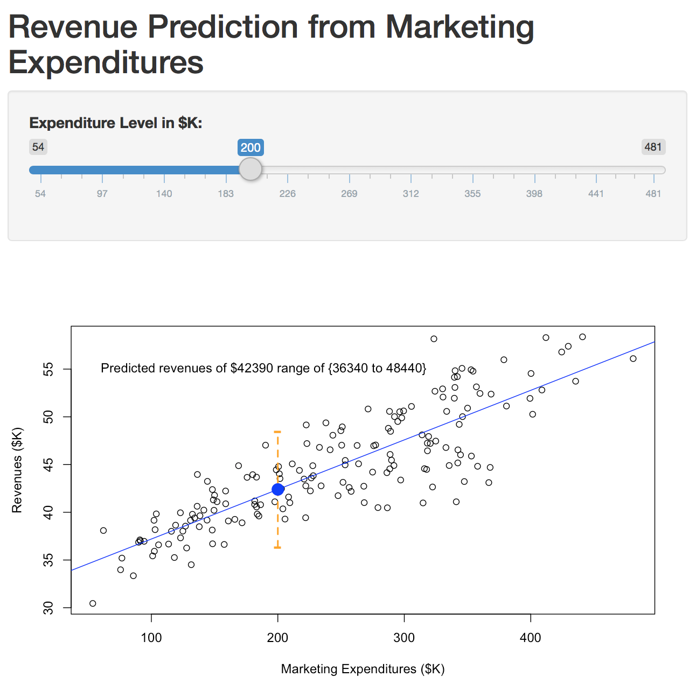
</p>
 
You can run this code and see how it works by running: 

```{r shiny-test-basic-app, eval=FALSE}
library(shiny)
runGitHub(repo = "com.packtpub.intro.r.bi",
          username = "StevenMMortimer",
          subdir = "Chapter8-ShinyDashboards/Ch8-BasicShinyApp")
```
 
### Reactivity

The UI side and the server side will communicate through a property called "reactivity". 
The plot is updated whenever the input slider changes. It "reacts" to it changing so 
the plot is always up-to-date.

```{r ui-input, eval=FALSE}
sliderInput(inputId = 'spend', 
            label = 'Expenditure Level in $K:',
            min = 54, max = 481, value = 250)
```

```{r server, eval=FALSE}
shinyServer(function(input, output) {
  output$prediction_plot <- renderPlot({
    newdata <- data.frame(marketing_total = input$spend)
    ...
```

The inputs and outputs are passed between each side of the app. `ui.R` provides `input$` 
that `server.R` accesses, then `server.R` provides `output$` that `ui.R` displays. 
A more in-depth discussion of reactivity is available here: https://shiny.rstudio.com/articles/understanding-reactivity.html

### Shiny App Example

The flexibility of Shiny allows you to build much more complex web applications. 
Below is an example app that 
 
```{r shiny-test-complex-app, eval=FALSE}
library(shiny)
runGitHub(repo = "com.packtpub.intro.r.bi",
          username = "StevenMMortimer",
          subdir = "Chapter8-ShinyDashboards/Ch8-CampaignCreatorApp")
```

### Shiny App Tips
 
<ol start="1">
  <b><li>Add a progress indicator!</li></b>
</ol>

The **shinysky** package has a function called `busyIndicator()` that quickly and 
easily implements a spinning wheel whenever calculations are happening in your app. 
This notifies users of when to wait for the app to finish processing before being 
able to click elsewhere in the app.

```{r busy, eval=FALSE}
busyIndicator(text = "Calculation in progress ... ", wait = 0)
```

The above code results in showing this: 

<p align="center">
  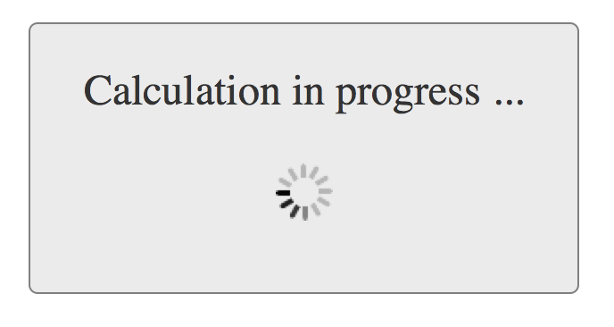
</p>

<ol start="2">
  <b><li>Learn and Use CSS!</li></b>
</ol>

CSS stands for Cascading Style Sheets and it is a syntax that defines the look and 
feel of web pages. Think of CSS as your personal library of good design. If you 
continually refine your designs via CSS, then they can quickly be adapted to any 
Shiny app that you build.

<p align="center">
  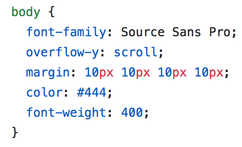
</p>

The CSS code above defines the font style, color, and size along with the margins 
for every page in the app unless otherwise specified.

<ol start="3">
  <b><li>Let Users Download Your Data</li></b>
</ol>

A big part of Shiny’s value proposition in the enterprise is promoting data democracy 
and the free sharing of information for use to further benefit the company. Shiny 
app users may prefer other tools, such as Excel or Tableau or Python. Empower your 
users and allow them the flexibility to intergrate into their preferred tool. The 
best way to facilitate that is to allow downloads of the data. The best package 
by far for displaying data and allowing for downloads is the **datatable** package. 
The following code snippet creates a row for your download button and then the datatable. 

```{r datatable, eval=FALSE}
fluidRow(
  column(12, downloadButton("downloadDataFromTable", "Download Table Data"))
)
fluidRow(
  column(12, DT::dataTableOutput("table", width = "100%"))
)
```

<p align="center">
  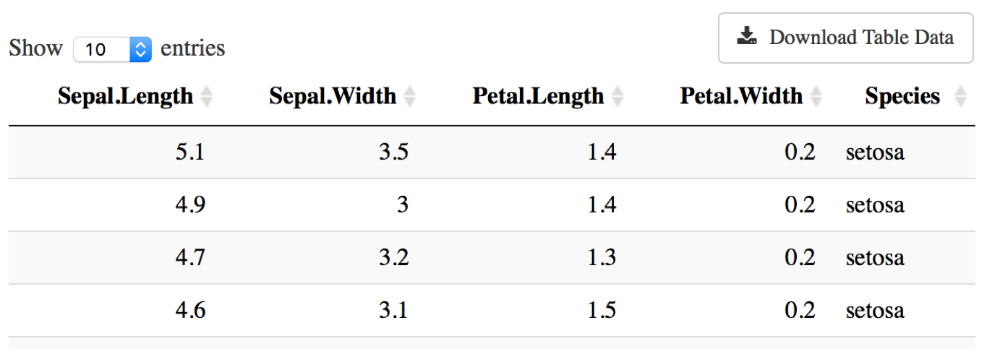
</p>

I recommend pulling the button to the right of the screen using `float: right;` 
in your CSS so the button is naturally placed at the top right of your table and 
ready for the user to click.
 
### Hosting Your Shiny App

Shiny apps need a server to run on so that users can access them whenever they want. 
There is a free service maintained by RStudio called at https://www.shinyapps.io/. 
The alternative is to host your apps privately by procuring a server from AWS, Azure, 
Heroku, etc. and installing R Shiny Server.
